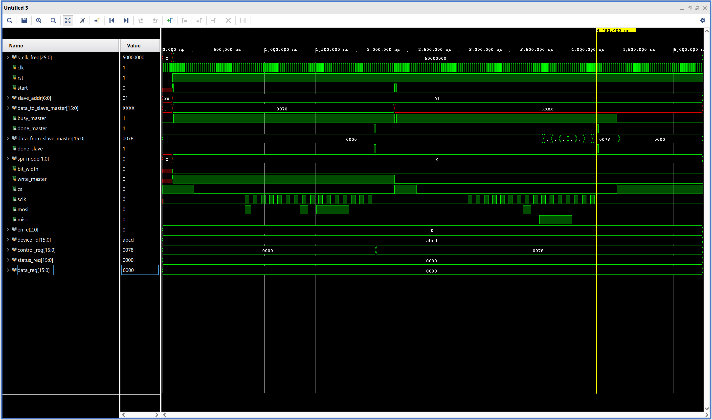
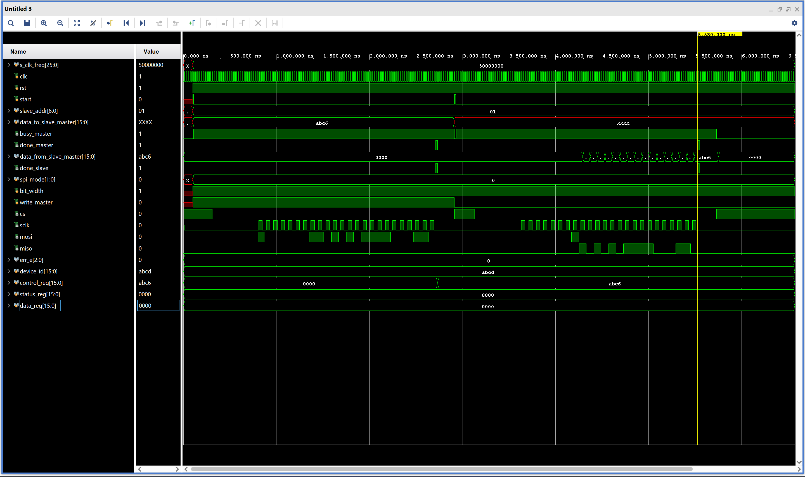
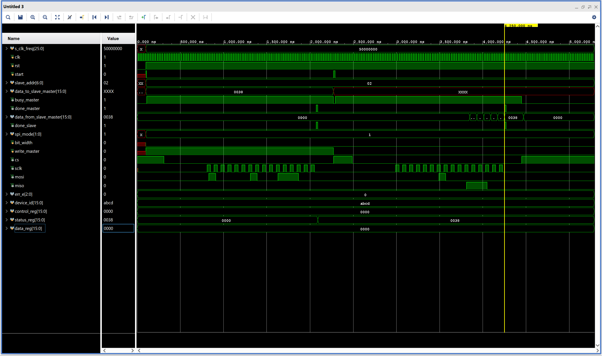
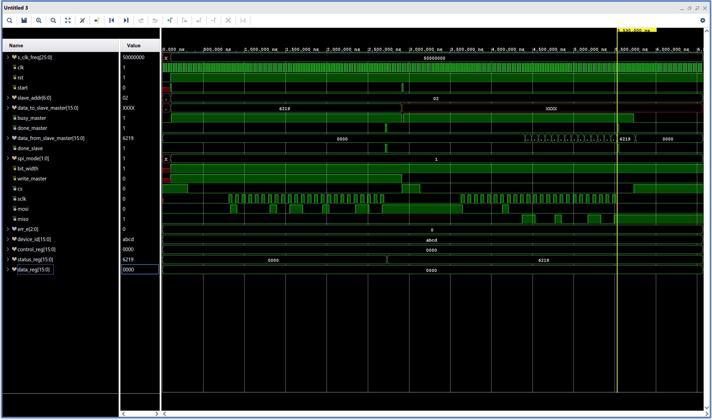
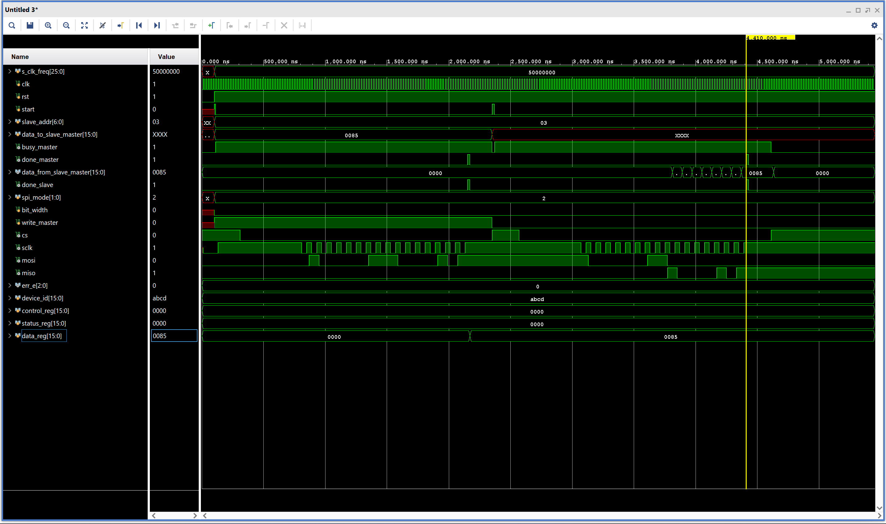
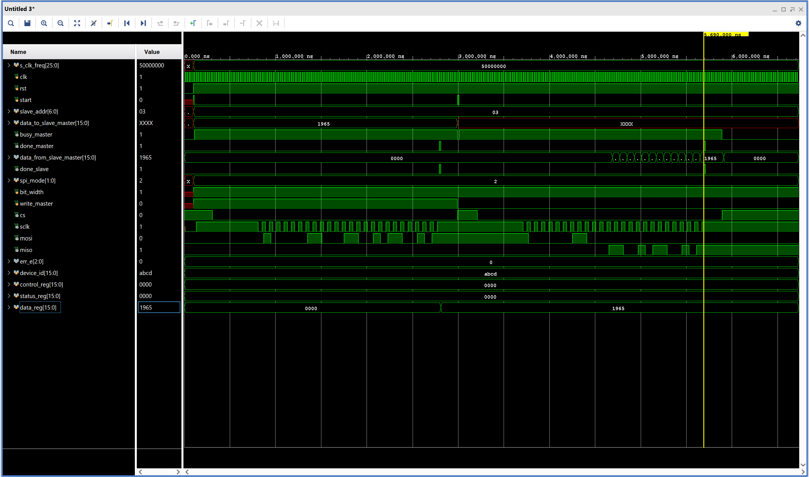
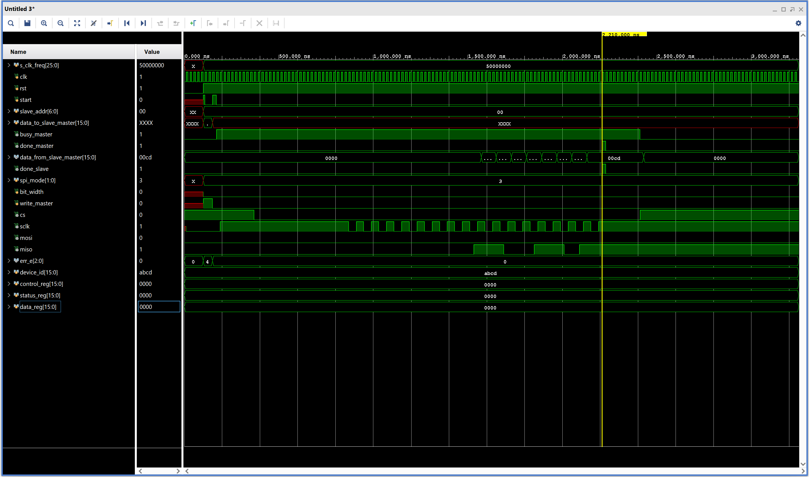
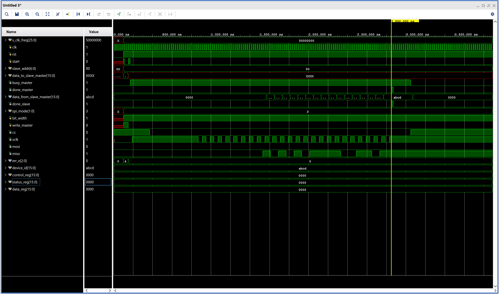

# Configurable SPI Master-Slave RTL Design

A configurable Verilog RTL implementation of an SPI Master and register-based SPI Slave supporting all four SPI modes, 8-bit and 16-bit data transfers, configurable SPI clock frequency, error handling, and self-checking verification.

## 1. Features

- SPI Modes 0, 1, 2, and 3
- 8-bit and 16-bit data operations
- Register-based read/write transactions
- Configurable SPI clock frequency
- Full-duplex SPI communication
- Active-low chip select
- Busy, done, and error indication
- Timeout detection
- CS timing validation
- Invalid-address and invalid-operation detection
- Back-to-back transactions

---

## 2. Repository Structure

```text
configurable-spi-master-slave/
│
├── README.md
│
├── rtl/
│   ├── spi_master.v
│   └── spi_slave.v
│
├── tb/
│   └── spi_top_tb.v
│
└── results/
    ├── simulation_waveforms/
    │   ├── spi_mode_0/
    │   ├── spi_mode_1/
    │   ├── spi_mode_2/
    │   └── spi_mode_3/
    │
    ├── simulation.log
    │
    ├── spi_master_synthesis_report/
    │   ├── Synthesis_in_VIVADO
    │   └── Synthesis_in_Cadence_Genus
    │
    └── spi_slave_synthesis_report/
        ├── Synthesis_in_VIVADO
        └── Synthesis_in_Cadence_Genus
```

---

## 3. System Configuration

| Parameter                   |       Configuration      |
|-----------------------------|--------------------------|
| System Clock                |          50 MHz          | 
| Reset                       |        Active Low        |
| SPI Modes                   |            0–3           |
| Data Width                  |       8 / 16 bits        |
| SPI Clock Range             | 1 Hz to System Clock / 4 (eg. for system clock=50MHz the <br>maximum spi clock frequency is 50MHz/4 ie. 12.5MHz) |
| Chip Select                 |        Active Low        |
| Communication               |        Full Duplex       |

The system clock is configurable before synthesis.

---

## 4. SPI Modes

|  Mode | CPOL | CPHA | Clock Idle | Sample Edge | Change Edge |
|-------|------|------|------------|-------------|-------------|
|   0   |  0   |   0  |    Low     |   Rising    |   Falling   |
|   1   |  0   |   1  |    Low     |   Falling   |   Rising    |
|   2   |  1   |   0  |    High    |   Falling   |   Rising    |
|   3   |  1   |   1  |    High    |   Rising    |   Falling   |

The Master uses mode-specific transfer states (`TRANS_M0`–`TRANS_M3`) to implement the required clock and data timing.

---

## 5. Transaction Format

Each transaction contains:

```text
Operation bit + 7-bit Register Address + Data
```

### 8-bit Data Operation

```text
[ Read/Write | Register Address | Data   ]
[     1      |      7 bits      | 8 bits ]
```

Total: **16 SPI clock cycles**

### 16-bit Data Operation

```text
[ Read/Write | Register Address | Data    ]
[     1      |      7 bits      | 16 bits ]
```

Total: **24 SPI clock cycles**

For a read, the Master transmits dummy data during the data phase and receives the selected register value from the Slave on `miso`.

---

## 6. Master Interface

| Signal | Direction | Description |
|---|---|---|
| `clk` | System Clock to Master | 50 MHz system clock (parameterised) |
| `rst` | External to Master | Active-low reset |
| `start` | External to Master | Starts a transaction <br>`1'b0` → no new transaction <br>`1'b1` → starts a new transaction |
| `spi_mode[1:0]` | External to Master | SPI mode selection:<br>`2'b00` → Mode 0<br>`2'b01` → Mode 1<br>`2'b10` → Mode 2<br>`2'b11` → Mode 3 |
| `bit_width` | External to Master | `1'b0` = 8-bit <br> `1'b1` = 16-bit |
| `s_clk_freq[25:0]` | External to Master | Requested SPI clock frequency |
| `data_to_slave[15:0]` | External to Master | Write data |
| `write` | External to Master | Read/write selection <br>`1'b0` → to read data from slave registers <br>`1'b1` → to write data to slave registers|
| `slave_addr[6:0]` | External to Master | Register address <br>`'h00` → Device ID <br>`'h01` → Control Register <br>`'h02` → Status Register <br>`'h03` → Data Register |
| `busy` | Master to External | Transaction active <br>`1'b0` → ready for new transaction <br>`1'b1` → a transaction is active, cannot start a new transaction |
| `done` | Master to External | Transaction complete <br>`1'b0` → shift register is not ready to be sampled <br>`1'b1` → the shift register is ready to be sampled |
| `err_e[2:0]` | Master to External | Error code: <br>`3'b000` → no error <br>`3'b001` → Timeout <br>`3'b010` → Invalid Register <br>`3'b011` → cs asserted high before completion of transaction <br>`3'b100` → Writing a Read-Only register <br>`3'b101` → s_clk_freq=0 |
| `data_from_slave[15:0]` | Master to External | Received data (read from slave registers)|
| `cs` | Master to Slave | Chip Select to Enable Transaction|
| `sclk` | Master to Slave | SPI Clock for Synchronisation |
| `miso` | Slave to Master | To receive Serial data from Slave|
| `mosi` | Master to Slave | To transmit Serial data to Slave |

Configuration inputs are captured in the Master IDLE state when `start` is asserted. A new `start` request is not accepted while `busy` is active.

---

## 7. SPI Clock Generation

The SPI clock is derived from the 50 MHz system clock using the requested `s_clk_freq`.

The maximum supported SPI frequency is:

```text
F_SPI(max) = F_SYS / 4
           = 50 MHz / 4
           = 12.5 MHz
```

A requested frequency of `0 Hz` is treated as an invalid configuration.

The generated SPI clock uses the appropriate idle level and edge relationship for the selected CPOL/CPHA mode.

---

## 8. Chip-Select Timing

The Master controls the active-low `cs` signal.

The following timing parameters can be configured before synthesis of the design:

```text
cs_high_ns
cs_negedge_to_clk_edge_ns
clk_edge_to_cs_high_ns
```

These represent:

1. Minimum CS high time between transactions
2. Delay from CS assertion to the first SPI clock edge
3. Delay from the final SPI clock edge to CS deassertion


---

## 9. Timeout Calculation

The timeout mechanism prevents a transaction from remaining active indefinitely.

For the implemented transaction structure:

```text
data_count = 7   for 8-bit data
data_count = 15  for 16-bit data
```

The timeout threshold is calculated from the transaction length and SPI clock timing:

```text
threshold_timeout = 3 × (data_count + 9) × 2 × (half_count_sclk+1)
```

where:

- `data_count` represents the number of data bits minus one.
- `half_count_sclk` represents the system-clock count for one half-period of the generated SPI clock.
- `(data_count + 9)` accounts for the operation bit, address bits, data bits, and transaction overhead.
- The factor `2` converts SPI half-cycles to complete clock cycles.
- The factor `3` provides timeout margin.

The exact numerical threshold for a particular transaction therefore depends on the selected data width and SPI clock frequency.

---

## 10. Error Detection

The Master reports errors through `err_e[2:0]`.

| Code | Error | Priority |
|---|---|---:|
| `000` | No error | — |
| `001` | Timeout | 2 |
| `010` | Invalid register address | 3 |
| `011` | Incorrect CS high | 1 |
| `100` | Invalid operation (Writing a read-only register) | 4 |
| `101` | SPI clock frequency = 0 | 5 |

When multiple conditions are detected, the defined priority determines the reported error.

---

## 11. FSM Diagram of Master


---

## 12. SPI Slave

The Slave provides a register-based SPI peripheral.

### Interface

| Signal | Direction |Description |
|---|---|---|
| `clk` | System Clock to Slave | 50 MHz system clock (parameterised) |
| `rst` | External to Slave | Active-low reset |
| `spi_mode[1:0]` | External to Slave | SPI mode selection:<br>`2'b00` → Mode 0<br>`2'b01` → Mode 1<br>`2'b10` → Mode 2<br>`2'b11` → Mode 3 |
| `bit_width` | External to Slave | `1'b0` = 8-bit <br> `1'b1` = 16-bit |
| `done` | Slave to External | Transaction complete <br>`1'b0` → shift register is not ready to be sampled <br>`1'b1` → the shift register is ready to be sampled |
| `cs` | Master to Slave | Chip Select to Enable Transaction|
| `sclk` | Master to Slave | SPI Clock for Synchronisation |
| `miso` | Slave to Master | To transmit Serial data to Master|
| `mosi` | Master to Slave | To receive Serial data from Master|

---

## 13. FSM Diagram of Slave


---

## 14. Slave Register Map

| Address | Register | Access |
|---|---|---|
| `0x00` | Device ID | Read-Only |
| `0x01` | Control Register | Read/Write |
| `0x02` | Status Register | Rread/Write | 
| `0x03` | Data Register | Read/Write |

Device ID:

```text
16'hABCD
```

All these register are simple registers to verify proper transaction.

---

## 14. Read and Write Operations

### Read

```text
Master → Slave : Read/Write bit + Register Address + Dummy Data
Slave  → Master: Selected Register Data
```

The Slave decodes the address and shifts the selected register value onto `miso`. The Master samples the data according to the selected SPI mode.

### Write

```text
Master → Slave : Write bit + Register Address + Write Data
```

The Slave decodes the address and updates the corresponding writable register.

---

## 15. Verification Environment

The verification environment is implemented in:

```text
tb/spi_top_tb.v
```
### Master-Slave Testbench Block Diagram


The testbench generates stimulus, drives Master and Slave configuration, monitors transactions, checks expected results, and logs failures.
`clk`, `rst`, `spi_mode`, and `bit_width` are driven by the testbench. The Master and Slave therefore receive the same configuration and timing-control signals from the testbench.

### Main Test Cases

| Category | Tests |
|----------|-------|
| SPI Modes | Modes 0, 1, 2, 3 |
| Data Width | 8-bit, 16-bit |
| Operations | Read, Write |
| Clock | Multiple divider/frequency settings |
| Transactions | Back-to-back transfers |
| Control | Start while busy |
| Reset | Reset during transaction |
| Address | Invalid register address |
| Timing | Incorrect CS / clock count |
| Error | invalid operation, zero frequency |
| Random | Randomized transactions |

---

## 16. Simulation Waveforms

The core waveform demonstrations can be organized as two cases per SPI mode:

1. 8-bit write and read
2. 16-bit write and read

### SPI Mode 0

1. 8-bit Transactions



2. 16-bit Transactions



### SPI Mode 1

1. 8-bit Transactions



2. 16-bit Transactions



### SPI Mode 2

1. 8-bit Transactions



2. 16-bit Transactions



### SPI Mode 3

1. 8-bit Transactions



2. 16-bit Transactions



---

## 17. Automated Checking

The testbench checks:

- Operation bit
- Register address
- Returned data
- Register updates
- Transaction completion
- Busy behavior
- Error code
- SPI mode timing
- Back-to-back operation

Results are written to:

```text
results/simulation.log
```

---

## 18. Synthesis Results

### Vivado — SPI Master

| Metric | Result |
|---|---:|
| LUTs | 1097 |
| Flip-Flops | 190 |
| DSPs | 1 |
| I/O | 81 |
| BUFG | 1 |

### Vivado — SPI Slave

| Metric | Result |
|---|---:|
| LUTs | 98 |
| Flip-Flops | 106 |
| I/O | 10 |
| BUFG | 1 |


### Cadence Genus — SPI Master

| Metric | Result |
|---|---:|
| Combinational Area | TBD |
| Sequential Area | TBD |
| Total Cell Area | TBD |
| Critical Path Delay | TBD |
| Slack | TBD |
| Total Power | TBD |

### Cadence Genus — SPI Slave

| Metric | Result |
|---|---:|
| Combinational Area | TBD |
| Sequential Area | TBD |
| Total Cell Area | TBD |
| Critical Path Delay | TBD |
| Slack | TBD |
| Total Power | TBD |

---

## 19. Tools

- Xilinx Vivado
- Cadence Genus

---

## 20. Limitation

- Due to integer division the SPI clock frequency might be greater than the required SPI clock frquency if the System clock frequency is not divisible by spi clock frequency.
- Minimum four system clock cylces are required for every spi clock for proper fsm operation.
- Single master and single slave architecture.
- Limited register and even those are dummy registers.
- Fixed transaction size of 8/16-bit data.
- Multiple SPI Slave support

---

## 21. Future Improvements

- SystemVerilog Assertions
- Functional coverage
- UVM-based verification
- Formal protocol verification
- FIFO-based buffering
- Multiple SPI Slave support
- AXI/APB interface integration

---

## 22. Author

**S Sanjay Ramasamy**  
B.Tech Electrical and Electronics Engineering, VIT Vellore (final-year)

Interests: RTL Design, Digital VLSI, FPGA Design, ASIC Design, Computer Architecture, and Hardware Verification.
